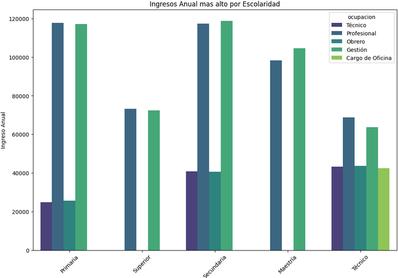
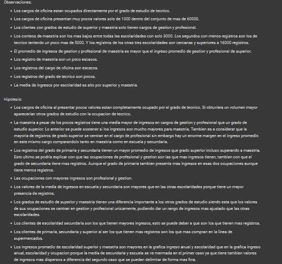
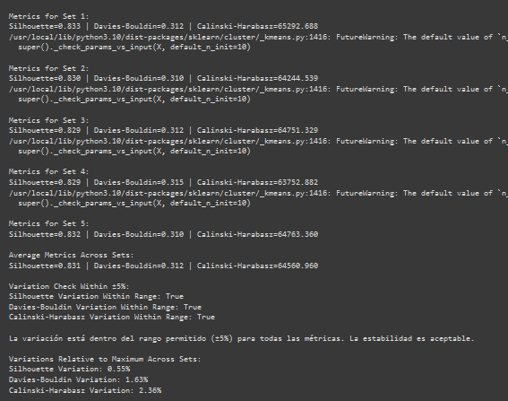

<p align="center">
   <h1 align="center"> Mi proyecto Esencia del Cliente (Desafio).</h1>
</p>
  
<p align="center"></p>

## Descripción:

Esencia del cliente parte I trata del analisis de la linea de supermercados Food Mart (CFM) del dataset de kaggle [dataset](https://colab.research.google.com/). Los datos son analizados de manera general, luego se crea un modelo con las mejores variables del set de datos y los mejores hiperparametros. Posteriormente se realizan pruebas de validacion para asegurar que el modelo de clusterizacion sea estable. Al finalizar se predijeron los datos del dataset con los del modelo de clusterizacion; se unieron a un mismo dataframe para realizar un analisis de los clusters y describir cada cluster con recomendaciones de acciones a realizar por cada uno de estos clusters. 


## Características Principales

- Graficas de calor y correlacion para la eleccion de las mejores variables.
- Traduccion del dataframe.
- Graficas enfocadas en encontrar caracteristicas de los clientes(datos).
- Observaciones e Hipotesis.
- Eleccion de variables y prueba para elejir las mejores columnas(Variables) con diferentes tipos de datos(categorico ordinal,nominal y numerico).
- Modelo de clusterizacion Kmeans con pruebas de silhouette, davies_bouldin, calinski_harabasz.
- Prueba de integridad.
- Modelos con los tres tipos de datos mencionados con el cumplimiento de todas las pruebas anteriores.
- OneHotEncoding, Estandarizacion y dummies.
- Descripcion de clusters y recomendaciones a efectuar.
- Funciones con bucles y GridSearchCv para obtener los mejores hiperparametros en arboles de decision, bosques de decision y SVC.
- Tratamiento con predicciones del modelo.








## Instrucciones de Uso

Para ejecutar el proyecto, se recomienda ejecutar el notebook en Google Colab. Si optas por otro método, asegúrate de descargar todas las librerías usadas y luego importarlas. Con esto, podrás ejecutar todas las celdas de código.


## Requisitos Previos

### Google Colab
1. Sigue el orden de ejecución de cada sección.

### Otros Entornos
1. Instala las siguientes bibliotecas:
   
  - pandas
  - numpy
  - matplotlib
     - matplotlib.pyplot 
  - seaborn
  - scikit-learn
     - sklearn.tree.DecisionTreeClassifier
     - sklearn.svm.SVC
     - sklearn.ensemble.RandomForestClassifier
     - sklearn.cluster.KMeans
     - sklearn.metrics.silhouette_score
     - sklearn.metrics.davies_bouldin_score
     - sklearn.metrics.calinski_harabasz_score
     - sklearn.model_selection.train_test_split
     - sklearn.preprocessing.OneHotEncoder
     - sklearn.preprocessing.StandardScaler
     - sklearn.model_selection.cross_validate
     - sklearn.model_selection.GridSearchCV


```python
pip install pandas numpy matplotlib seaborn scikit-learn

```

## Instalación

Para instalar el proyecto, sigue la secuencia de ejecución en Google Colab, la cual instalará las bibliotecas necesarias. Si utilizas otro entorno, instala cada biblioteca antes de importarlas.

## Ejemplos de Uso

La ejecucion de las celdas es lineal. Podras ver todos los graficos y codigo en funcionamiento siguiendo la linea de ejecución.


## Autor

- **Os-688**

## Agradecimientos

Agradezco a scikit-learn por una herramienta eficaz para aprender y efectuar Modelos de aprendizaje. Tambien agradezco a Alura Latam por darme este nuevo desafio.

## Estado del Proyecto

Versión 1.0 estable. Última actualización: 28/01/2024.
